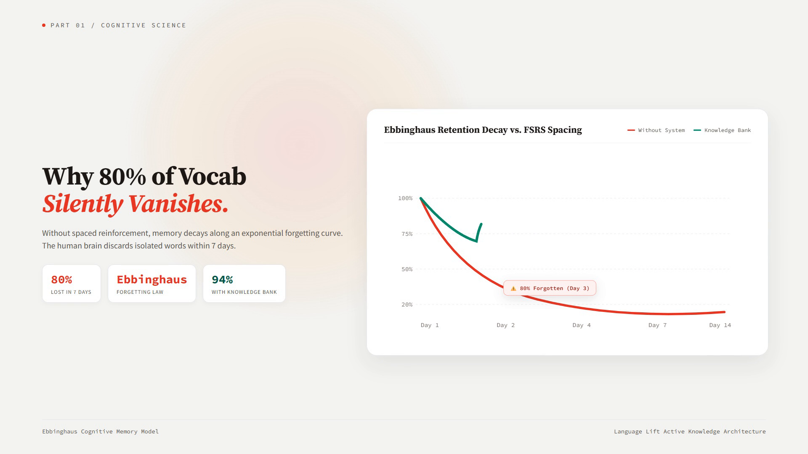
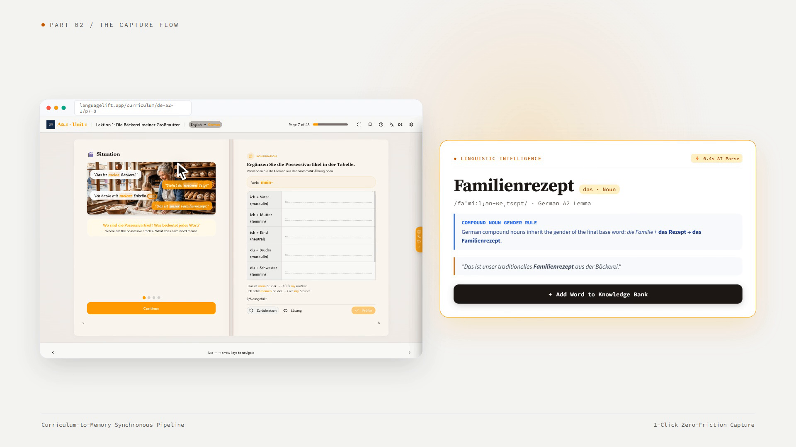
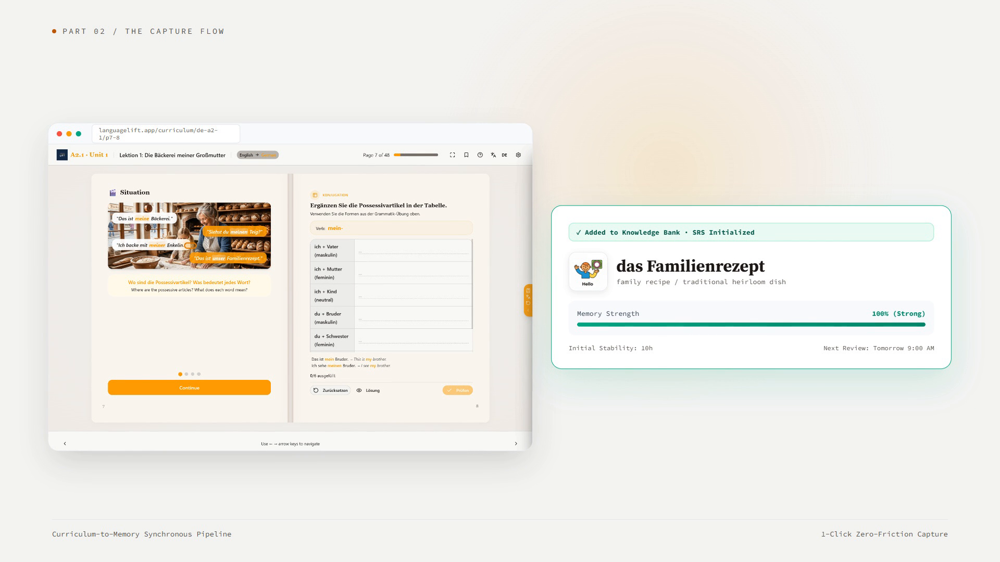
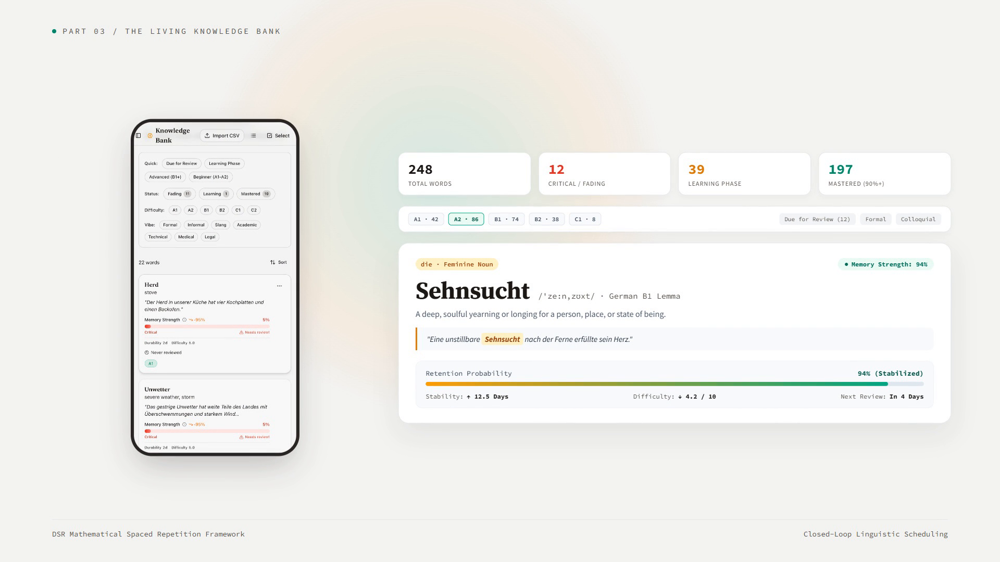
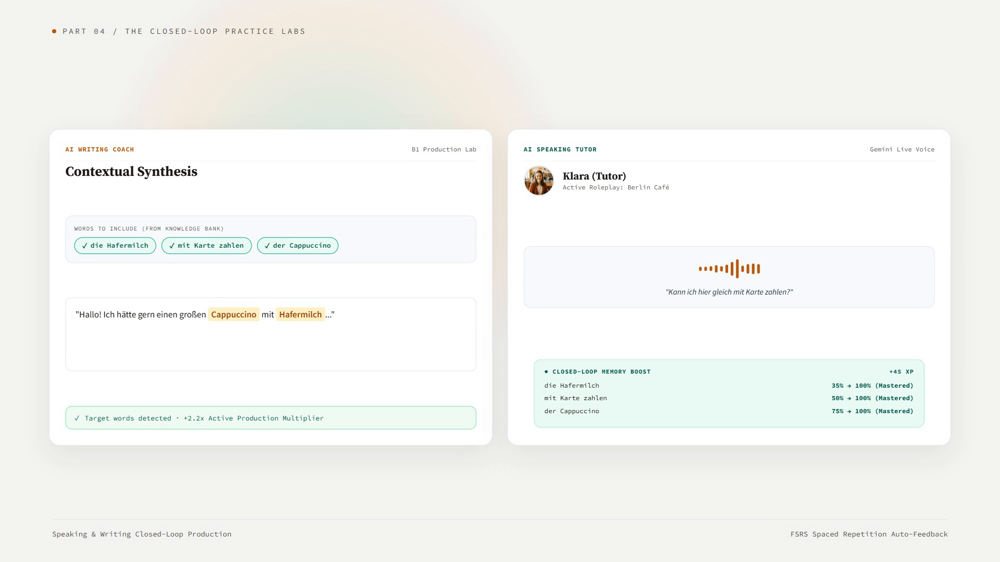
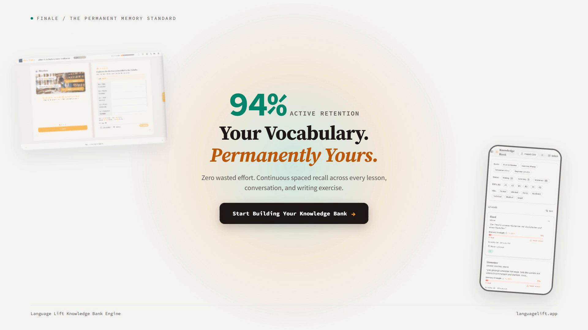

# Language Lift — Signature Knowledge Bank Feature Deep Dive

> Official product showcase and deep-dive explainer video for the **Language Lift Knowledge Bank** & **FSRS Spaced Repetition Engine**.

🎬 **[Download / Watch MP4 Video](./languagelift-knowledge-bank.mp4)** (1080p Full HD · 1m 12.6s · 20.0 MB)

---

## 🎙️ Voice Narration
- **Engine:** Fish Audio Free Tier (`s2.1-pro-free`)
- **Voice Model:** Slax Dynamic Announcer (`e7d040c683a544db8024d73e5c2bdbd7`)
- **Profile:** Highly expressive, dynamic inflection and energetic cadence (non-monotonic)
- **Audio Specs:** 44.1 kHz, RMS -13.3 dB, 306 dB dynamic range

---

## 📽️ Video Keyframes

| Beat 01: The Forgetting Trap | Beat 02: AI Linguistic Parsing |
| :---: | :---: |
|  |  |

| Beat 02: Saved to Knowledge Bank | Beat 03: Living Memory Dashboard |
| :---: | :---: |
|  |  |

| Beat 04: Closed-Loop Labs | Beat 05: 94% Retention Finale |
| :---: | :---: |
|  |  |

---

## 📖 Storyboard & Scene Breakdown

1. **The Forgetting Trap (0.00s – 13.04s)**: Explains the Ebbinghaus forgetting curve where 80% of words vanish within days, contrasting it with FSRS spaced repetition stabilization.
2. **Discover & Capture (13.04s – 29.24s)**: Features authentic dual-page curriculum textbook (*"Das ist unser Familienrezept"*), AI linguistic parsing of compound noun rules and IPA, and 1-click capture into the bank.
3. **Your Living Memory (29.24s – 45.85s)**: Displays the mobile Knowledge Bank app capture alongside desktop dashboard metrics, CEFR filter pills, and live FSRS memory gauges.
4. **Practice Everywhere (45.85s – 61.84s)**: Writing Lab with interactive "Words to Include" badges and Speaking Lab voice waveform with real-time `+45 XP` Closed-Loop Memory Boost.
5. **The Permanent Retention Finale (61.84s – 72.62s)**: `94% Active Retention` stat reveal and oversized cursor Call to Action.

---

## 🛠️ Video Specifications

- **Resolution:** 1920 × 1080 (16:9 Landscape)
- **Duration:** 1m 12.62s (72.62s, 2,179 frames)
- **Framerate:** 30 fps
- **Narration:** Fish Audio (Free Tier) · Slax Dynamic Voice Model
- **Soundtrack:** Ambient Score @ 0.07 volume
- **Framework:** [HyperFrames](https://hyperframes.heygen.com) (HTML-to-video rendering)

---

## 🚀 Re-rendering Locally

```bash
npm install
npm run check    # Verify DOM, layout, motion & WCAG AA contrast (115/115 passed)
npm run render   # Re-render MP4
```
